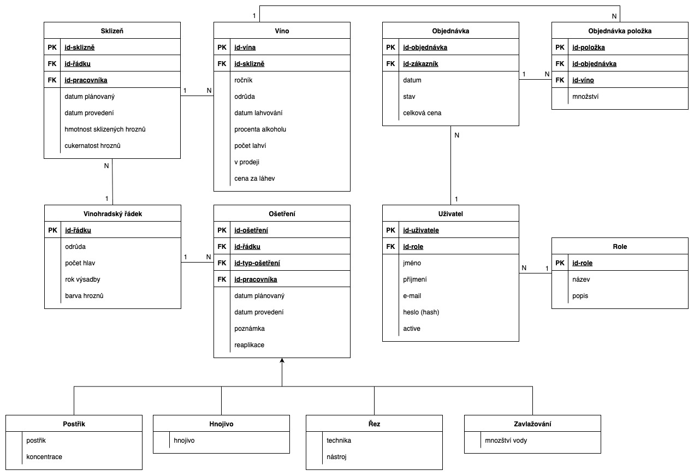

Projekt IIS 

Vinařství
=========

Autoři

Nikol Vaněčková [xvanecn00@stud.fit.vutbr.cz](mailto:xvanecn00@stud.fit.vutbr.cz) - stránky pro vinaře a pracovníka vinařství

Matej Menich [xmenicm00@stud.fit.vutbr.cz](mailto:xmenicm00@stud.fit.vutbr.cz) - stránky pro návštěvníka a zákazníka

Jáchym Gregor [xgregoj00@stud.fit.vutbr.cz](mailto:xgregoj00@stud.fit.vutbr.cz) - stránky pro administrátora a přihlášení

URL aplikace

[https://iis-vinarstvi.infinityfree.me/](https://iis-vinarstvi.infinityfree.me/) // momentálně nefunkční :(

Uživatelé systému pro testování
-------------------------------

Uveďte prosím existující zástupce **všech rolí uživatelů**.

Login

Heslo

Role

admin@vinarstvi.cz

admin123

Administrátor

pracovnik@vinarstvi.cz

pracovnik

Pracovník

vinar@vinarstvi.cz

vinar1

Vinař

zakaznik@vinarstvi.cz

heslo123

Zákazník

(Diagram případů užití není nutné vkládat, pokud IS implementuje role a případy užití definované zadáním.)

### Video

[https://www.youtube.com/watch?v=apwAJ3VDd7Q](https://www.youtube.com/watch?v=apwAJ3VDd7Q)

### Implementace

#### Matej Menich

Prohlížení vína (metoda index) je implementováno pomocí VinoController, který vypíše všechny vína v databázi podle ročníku.

Prohlížení (metoda index) a upravování nákupního košíku (metody add, update, clear, remove) je implementováno pomocí KosikController, který také v sekci košík vypíše historii objednávek zákazníka (metoda index).

O vybavení objednávky se stará ObjednavkaController. Metoda create vytvoří objednávku, následne jí přidá do databáze a upraví sklad v databázi. Metoda potvrdena načte vytvořenou objednávku a zobrazí ji.

#### Jáchym Gregor

Auth: signUp vytváří uživatele po validaci a se zahashovaným heslem; signIn ověřuje údaje a vytváří session/token; signOut ukončí session. Přístup k chráněným akcím zajišťuje middleware.

Admin: administrace uživatelů (seznam, detail, změna rolí, smazání) a přehled objednávek; všechny akce jsou omezeny autorizací (role admin).

#### Nikol Vaněčková

##### Vinař

Implementováno v VinarController, metody index, rowCreate, storeRow, editRow, updateRow, deleteRow. Zobrazování a úprava probíhá přes Blade šablony vinar.blade.php, vinar\_row\_create.blade.php, vinar\_row\_edit.blade.php. Plánování a evidence ošetření a sklizní naprosto obdobně jen s rozdílem předpony osetreni a harvest. Správa vín a zařazení do prodeje: Činnosti v metodách createVino, storeVino, publishVino, unpublishVino. Odpovídající šablony jsou vinar-vino-create.blade.php, část Prodej ve vinar.blade.php. Veškeré ovládání dostupné pouze pro uživatele s rolí vinař nebo admin – kontrolováno v routách přes middleware role:3 nebo přímo ve VinarController.

##### Pracovník

Prohlížení přidělených ošetření a sklizní: Realizují metody index, editOsetreni, updateOsetreni, editHarvest, updateHarvest v PracovnikController. Zobrazování i úprava přes šablony pracovnik.blade.php, pracovnik\_harvest\_edit.blade.php apod. Značení ošetření a sklizní jako provedené (zadání data a údajů): Úprava hodnot v metodách updateOsetreni a updateHarvest (PracovnikController), formuláře ve výše zmíněných Blade šablonách. Přístup pouze pro uživatele s rolí pracovník nebo admin – ošetřeno middlewarem role:2 a kontrolou práv.

### Databáze

 

Instalace
---------

1.  Ujistěte se, že máte PHP 8.1+, Composer, MySQL/MariaDB, a webserver (Apache/Nginx).
2.  V kořenové složce spusťte composer install (a případně npm install && npm run build pro frontend).
3.  Nakopírujte .env.example na .env a nastavte připojení k databázi a další parametry.
4.  Vygenerujte aplikační klíč příkazem php artisan key:generate.
5.  Vytvořte a inicializujte databázi pomocí php artisan:migrate (a případně php artisan db:migrate --seed).
6.  Pro lokální spuštění použijte php artisan serve nebo na hostingu přejděte v prohlížeči na adresu projektu.

Známé problémy
--------------

V tomto projektě není žádný známý problém.
